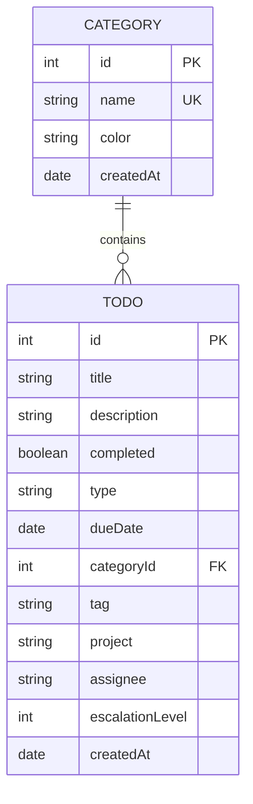

# ER Diagram

## Table Descriptions

### TODO
| Column | Type | Constraints | Description |
|--------|------|-------------|-------------|
| id | INT | PK, Auto-increment | Unique identifier |
| title | VARCHAR | NOT NULL | Todo title |
| description | VARCHAR | NULLABLE | Todo description |
| completed | BOOLEAN | DEFAULT false | Completion status |
| type | ENUM | NOT NULL | personal, work, urgent |
| dueDate | DATE | NULLABLE | Due date |
| categoryId | INT | FK -> CATEGORY.id | Category reference |
| tag | VARCHAR | NULLABLE | Personal todo tag (health, finance, hobby, general) |
| project | VARCHAR | NULLABLE | Work todo project name |
| assignee | VARCHAR | NULLABLE | Work todo assignee |
| escalationLevel | INT | NULLABLE | Urgent todo escalation (1-5) |
| createdAt | DATETIME | DEFAULT NOW | Creation timestamp |

### CATEGORY
| Column | Type | Constraints | Description |
|--------|------|-------------|-------------|
| id | INT | PK, Auto-increment | Unique identifier |
| name | VARCHAR | UNIQUE, NOT NULL | Category name |
| color | VARCHAR | NOT NULL | Hex color code |
| createdAt | DATETIME | DEFAULT NOW | Creation timestamp |

## Relationships

| From | To | Type | Description |
|------|-----|------|-------------|
| CATEGORY | TODO | One-to-Many | Category has many todos |
