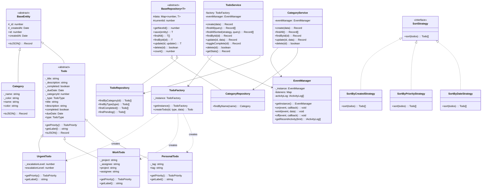

# Class Diagram

## Relationships Summary

| Relationship | Type | Description |
|-------------|------|-------------|
| BaseEntity -> Todo, Category | Inheritance | All entities extend BaseEntity |
| Todo -> PersonalTodo, WorkTodo, UrgentTodo | Inheritance | Todo type hierarchy |
| BaseRepository -> TodoRepository, CategoryRepository | Inheritance | Generic CRUD inherited |
| SortStrategy -> Concrete Strategies | Implementation | Strategy pattern |
| TodoFactory -> Todo subclasses | Creation | Factory pattern |
| EventManager -> Services | Association | Observer pattern |
