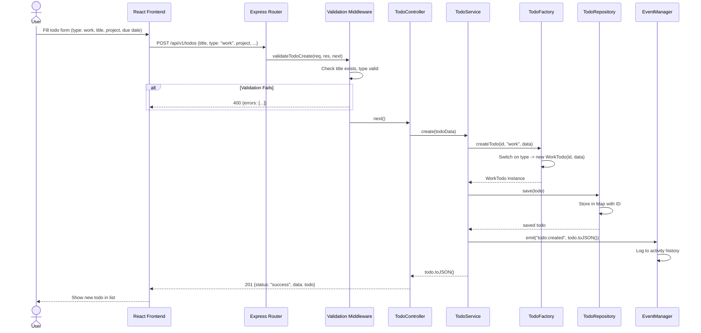
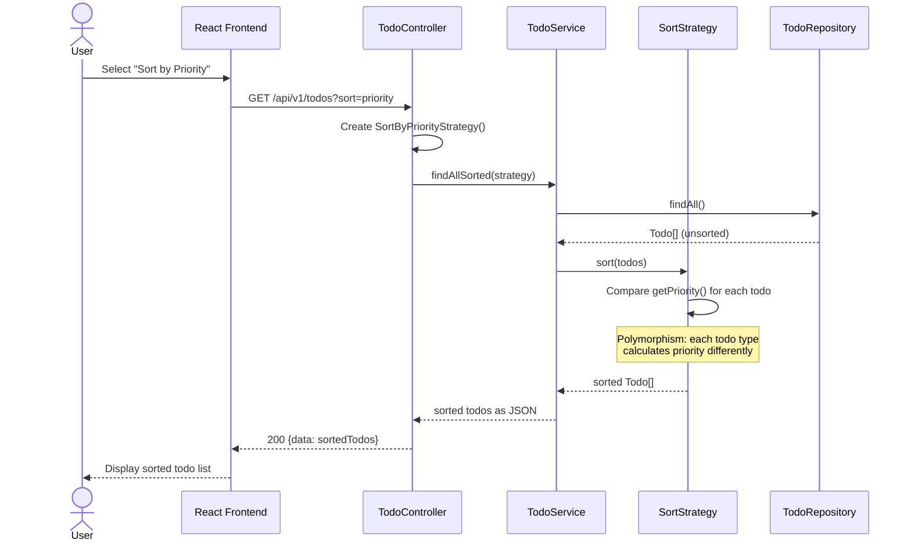
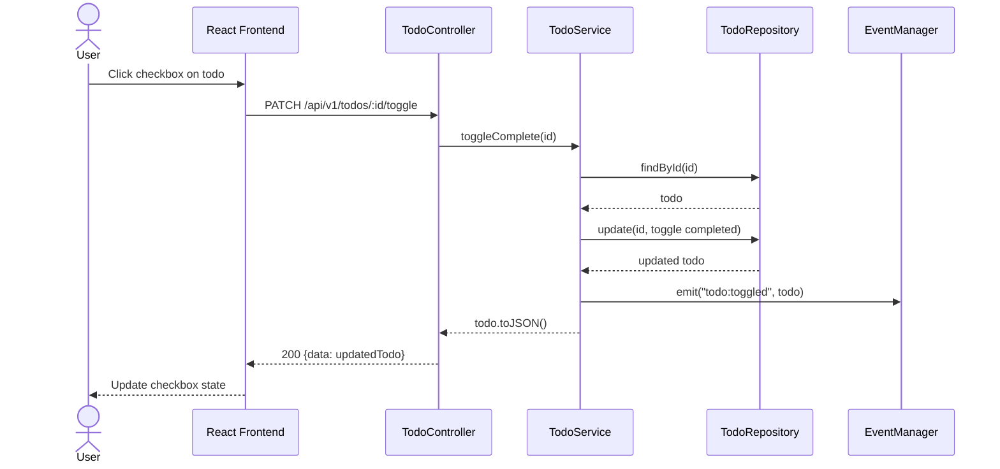

# Sequence Diagram

## Flow: Create a New Todo (End-to-End)

```mermaid
sequenceDiagram
    actor User
    participant Frontend as React Frontend
    participant Router as Express Router
    participant Middleware as Validation Middleware
    participant Controller as TodoController
    participant Service as TodoService
    participant Factory as TodoFactory
    participant Repo as TodoRepository
    participant Observer as EventManager

    User->>Frontend: Fill todo form (type: work, title, project, due date)
    Frontend->>Router: POST /api/v1/todos {title, type: "work", project, ...}

    Router->>Middleware: validateTodoCreate(req, res, next)
    Middleware->>Middleware: Check title exists, type valid
    alt Validation Fails
        Middleware-->>Frontend: 400 {errors: [...]}
    end
    Middleware->>Controller: next()

    Controller->>Service: create(todoData)

    Service->>Factory: createTodo(id, "work", data)
    Factory->>Factory: Switch on type -> new WorkTodo(id, data)
    Factory-->>Service: WorkTodo instance

    Service->>Repo: save(todo)
    Repo->>Repo: Store in Map with ID
    Repo-->>Service: saved todo

    Service->>Observer: emit("todo:created", todo.toJSON())
    Observer->>Observer: Log to activity history

    Service-->>Controller: todo.toJSON()
    Controller-->>Frontend: 201 {status: "success", data: todo}
    Frontend-->>User: Show new todo in list
```

## Flow: Sort Todos using Strategy Pattern

```mermaid
sequenceDiagram
    actor User
    participant Frontend as React Frontend
    participant Controller as TodoController
    participant Service as TodoService
    participant Strategy as SortStrategy
    participant Repo as TodoRepository

    User->>Frontend: Select "Sort by Priority"
    Frontend->>Controller: GET /api/v1/todos?sort=priority

    Controller->>Controller: Create SortByPriorityStrategy()
    Controller->>Service: findAllSorted(strategy)

    Service->>Repo: findAll()
    Repo-->>Service: Todo[] (unsorted)

    Service->>Strategy: sort(todos)
    Strategy->>Strategy: Compare getPriority() for each todo
    Note over Strategy: Polymorphism: each todo type<br/>calculates priority differently
    Strategy-->>Service: sorted Todo[]

    Service-->>Controller: sorted todos as JSON
    Controller-->>Frontend: 200 {data: sortedTodos}
    Frontend-->>User: Display sorted todo list
```

## Flow: Toggle Todo Completion

```mermaid
sequenceDiagram
    actor User
    participant Frontend as React Frontend
    participant Controller as TodoController
    participant Service as TodoService
    participant Repo as TodoRepository
    participant Observer as EventManager

    User->>Frontend: Click checkbox on todo
    Frontend->>Controller: PATCH /api/v1/todos/:id/toggle

    Controller->>Service: toggleComplete(id)
    Service->>Repo: findById(id)
    Repo-->>Service: todo

    Service->>Repo: update(id, toggle completed)
    Repo-->>Service: updated todo

    Service->>Observer: emit("todo:toggled", todo)
    Service-->>Controller: todo.toJSON()
    Controller-->>Frontend: 200 {data: updatedTodo}
    Frontend-->>User: Update checkbox state
```
