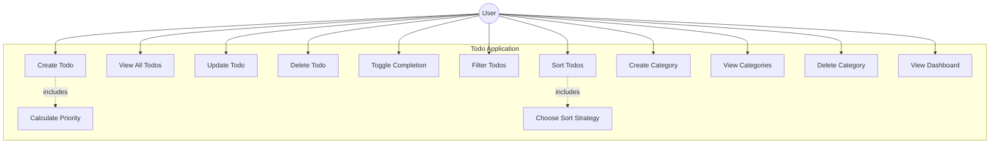

# Use Case Diagram

## Actors
- **User** - manages todos and categories

## Use Case Diagram (Mermaid)

## Use Case Descriptions

| # | Use Case | Description |
|---|----------|-------------|
| 1 | Create Todo | Add new todo (Personal / Work / Urgent) via Factory pattern |
| 2 | View Todos | List todos with filters (type, status, category) |
| 3 | Update Todo | Edit todo title, description, due date |
| 4 | Delete Todo | Remove todo |
| 5 | Toggle Completion | Mark todo done/undone |
| 6 | Filter Todos | Filter by type, completion status |
| 7 | Sort Todos | Sort using Strategy pattern (by date, priority, created) |
| 8 | Create Category | Add category with name and color |
| 9 | View Categories | List all categories |
| 10 | Delete Category | Remove category |
| 11 | View Dashboard | Stats: total, completed, pending, by type, by priority |
| 12 | Calculate Priority | Polymorphic priority based on todo type |
| 13 | Choose Sort Strategy | Select sort algorithm at runtime |
